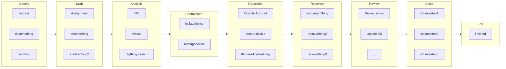

# Incident flow framework

```mermaid

flowchart LR

  identifySub-->draftSub
  draftSub-->analysisSub
  analysisSub-->containmentSub
  containmentSub-->eradicationSub
  eradicationSub-->recoverySub
  recoverySub-->reviewSub
  reviewSub-->closeSub
  closeSub-->endflowSub

  
  

subgraph identifySub[Identify]
  direction LR
  firsttask
  dosomething
  nestthing

end
subgraph draftSub[Draft]
     direction LR
    assignincident[Assignment]
    anotherthing
    anotherthing2
end


subgraph analysisSub[Analysis]
 direction LR
    IOC
    avscan
    sigthingsearch[Sigthing search]
end

subgraph containmentSub[Containment]
  direction LR
  isolatedevice
  reimagedevice
end


subgraph eradicationSub[Eradication]
  direction LR
  eradicationThing[Disable Account]
  seconderadicatinothing[Isolate device]
  thirderadicationthing 
end

subgraph recoverySub[Recovery]
  direction LR
  recoverynThing
  recoverthing2
  recoverthing3
end


subgraph reviewSub[Review]
  direction LR
  reviewnote[Review notes] 
  updateknowledge["`Update KB`"]
  reviewstep3["`_`"]
end


subgraph closeSub[Close]
  direction LR
  closurestep1
  closurestep2
  closurestep3

end


subgraph endflowSub["`End`"]
  direction LR

  finished

end

```
