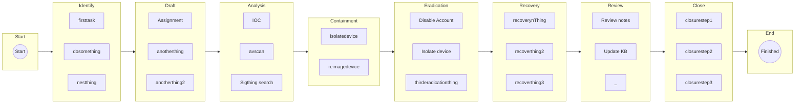

# Incident flow framework

```mermaid

flowchart LR

startSub-->identifySub
  identifySub-->draftSub
  draftSub-->analysisSub
  analysisSub-->containmentSub
  containmentSub-->eradicationSub
  eradicationSub-->recoverySub
  recoverySub-->reviewSub
  reviewSub-->closeSub
  closeSub-->endflowSub

  

subgraph startSub[Start]
 startstep((Start))
end


%% Identify Stage %%
subgraph identifySub[Identify]
  direction LR
  firsttask
  dosomething
  nestthing
end

%% Draft Stage %%
subgraph draftSub[Draft]
     direction LR
    assignincident[Assignment]
    anotherthing
    anotherthing2
end

%% Analysis Stage %%
subgraph analysisSub[Analysis]
 direction LR
    IOC
    avscan
    sigthingsearch[Sigthing search]
end


%%Containment Stage %%
subgraph containmentSub[Containment]
  direction LR
  isolatedevice
  reimagedevice
end

%%Eradicate Stage %%
subgraph eradicationSub[Eradication]
  direction LR
  eradicationThing[Disable Account]
  seconderadicatinothing[Isolate device]
  thirderadicationthing 
end


%% Recovery Stage %%
subgraph recoverySub[Recovery]
  direction LR
  recoverynThing
  recoverthing2
  recoverthing3
end

%% review Stage %%
subgraph reviewSub[Review]
  direction LR
  reviewnote[Review notes] 
  updateknowledge["`Update KB`"]
  reviewstep3["`_`"]
end

%% Clousure Stage %%
subgraph closeSub[Close]
  direction LR
  closurestep1
  closurestep2
  closurestep3

end

%% End of flow Stage %%
subgraph endflowSub["`End`"]
  direction LR
  finished((Finished))
end

```
